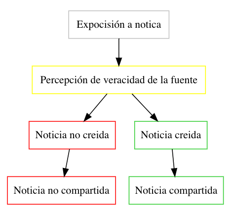

```{r, setup, include=FALSE}
knitr::opts_chunk$set(echo = T, message=F,warning = F)
```

\tableofcontents
\newpage

# Ambiente.

```{r}
#cargo librerias
library(readr)
library(stargazer)
library(dplyr)
library(ggplot2)
library(ggpubr)
library(RCT)
library(gridExtra)
library(kableExtra)
library(lmtest)

#leeo los datos
data<-read_csv("fake.csv")
```


# I.

En este trabajo se intentará explorar el efecto que tiene la percepción subjetiva de credibilidad en el hecho de aceptar una noticia como verdadera y en consecuencia compartirla en redes sociales. Concretamente, esta investigación averiguará el efecto que tiene la expocisión a noticias y fuentes falsas y verdaderas en el hecho de que una persona crea que en su veracidad y que la comparta. Para ellos se realizará un análisis de inferencia causal sobre los datos de un experimento aleatorizado. Los datos se basan en un experimento de encuesta en el que los individuos fueron asignados aleatoriamente a dos versiones de un informe de noticias en el que solo se varió el nombre de la fuente (y el diseño). Se intentará cuantificar los efectos de la veracidad de la fuente en la credibilidad del contenido.

En particular las hipótesis son 2^[orignalmente eran 4 pero dado los datos que tenemos, no eran relevantes ni posible evaluar las últimas dos]:

* Las personas tienden a creer más en las noticias de una fuente real que de una fuente falsa.

* Las personas serán más propensas a compartir informes de noticias queprovienen de fuentes reales que aquellos que provienen de fuentes falsas.

# II.

**Teoría de cambio**

```{r histograma, eval=FALSE}
DiagrammeR::grViz("digraph {
  graph [layout = dot, rankdir = TB]
  
  node [shape = rectangle]        
  rec1 [label = 'Expocisión a notica',color=grey]
  rec2 [label = 'Percepción de veracidad de la fuente',color=yellow]
  rec4 [label = 'Noticia no creida',color=red]
  rec5 [label = 'Noticia creida',color=limegreen]
  rec6 [label = 'Noticia no compartida',color=red]
  rec7 [label = 'Noticia compartida',color=limegreen]
  
  # edge definitions with the node IDs

  rec2 -> rec4-> rec6
  rec1 -> rec2  -> rec5-> rec7
  
  }", 
  height = 500)
```


\newpage

# III.

**Participantes**

Se trata de 1,980 idividuos de Alemania, preseleccionados de una muestra supuestamente aleatoria y representativa (una empresa extrna se encargo de eso) que contestaron una encuesta online.

**Variables de respuesta**

Había dos variables de respuesta; por un lado *y_belief_report_* que intenta medir en una escala del 0 al 6 el nivel de credibilidad de la noticia; y por el otro lado, *y_share_report_*, que indica un score sobre qué tanto se compartiría dicha notica en redes sociales.

**Clasificación en grupos**

Se dividió en grupos de acuerdo al tipo de notica al que la persona fue expuesto: tratamiento, si la fuente de la notica era falso; y control, si la fuente era verdadera.

**Covariables**

Las covariables son la edad, el sexo, el nivel de ingreso (medido en 11 niveles) y eñ nivel de educación (medido en 5)

**¿Cómo se implementó el experimento?**

Los individuos fueron asignados aleatoriamente a dos versiones de un informe de noticias en el que solo se varió el nombre de la fuente (y el diseño).

# IV.

Para el EDA se optó por realizar un análisis gráfico:

## Variable de clasificación
```{r EDAp}
#cargo librerias
ggplot(data, aes(x=d_treatment_source)) + 
 geom_bar(colour="black", fill="white")+ggtitle("Grupos entre control y tratamiento")

```
 Lo que podemos ver esque la repartición entre los grupos fue muy similar.

## Variables de respuesta
```{r EDA}
#cargo librerias
ggplot(data, aes(x=y_belief_report_num)) + 
 geom_bar(colour="black", fill="white")+ggtitle("Frecuencia de indice de credibilidad (0-6)")
```

Notamos que el indice de credibilidad está sesgado a la derecha. Dado que los grupos de control y tratamiento son de aproximadamente del mismo tamaño, esto indica que hay una tendencia mayor a creer en la fuente.

```{r EDA 1}
a<-ggplot(data, aes(x=y_share_report_email_num)) + 
 geom_bar(colour="black", fill="white")+ggtitle("Frecuencia de reporte por email")

b<-ggplot(data, aes(x=y_share_report_fb_num)) + 
 geom_bar(colour="black", fill="white")+ggtitle("Frecuencia de reporte por facebook")

c<-ggplot(data, aes(x=y_share_report_twitter_num)) + 
 geom_bar(colour="black", fill="white")+ggtitle("Frecuencia de reporte por twitter")

d<-ggplot(data, aes(x=y_share_report_whatsapp_num)) + 
 geom_bar(colour="black", fill="white")+ggtitle("Frecuencia de reporte por whatsapp")
ggarrange(a,b,c,d, 
          ncol = 2, nrow = 2)
```

Asimismo, en cuanto a las variables de compartir la noticia por plataforma, notamos que en general la gente no comparte contenidos. Sin embargo, dado el balance de los grupos, notamos que la gente se atreve a compartir noticias ligeramente más a través de las redes sociales facebook y twitter.


## Covariables

```{r EDA 2}
a<-ggplot(data, aes(x=x_age)) + 
 geom_bar(colour="black", fill="white")+ggtitle("Frecuencia de edad")

b<-ggplot(data, aes(x=x_sex_num)) + 
 geom_bar(colour="black", fill="white")+ggtitle("Frecuencia de sexo")
c<-ggplot(data, aes(x=x_income_num)) + 
 geom_bar(colour="black", fill="white")+ggtitle("Frecuencia del grupo de ingreso")


d<-ggplot(data, aes(x=x_education_num)) + 
 geom_bar(colour="black", fill="white")+ggtitle("Frecuencia del grupo de educación")


ggarrange(a,b,c,d, 
          ncol = 2, nrow = 2)
```
Finalmente notamos que en cuanto a edades, en general hay buen balance, con dos picos muy claros en menores a 20 y alrededor del 55. En cuanto a sexo, los grupos son virtualmente del mismo tamaño. En cuanto a grupo de ingreso, la media es en el grupo 5 con una distribución con una cola a la derecha larga. Finalmente, en cuanto a grupo de educación, el nivel 2 es el más frecuente, seguido del 5, con el grupo 3 como grupo más pequeño, lo cual demuestra que es una distribución poco simétrica y muy peculiar.

# V.

Para esta parte no contamos con los datos suficientes para replicar las tablas debido a que no se nos proporcionaron datos de la variable content ni de las de actitud sobre la migración y voto.

```{r balance}
data_filteres<-data %>% select(x_age,x_sex_num,d_treatment_source)
bt_personal<-balance_table(data_filteres,treatment = "d_treatment_source")

kable(as.data.frame(bt_personal),booktabs=T,caption = "Balance de variables disponibles",
      longtable=T,digits=2)%>%
kable_styling(position = "center",latex_options = "repeat_header")
```

En ambas variables no hay diferencias estadísticamente significaticas entre sus medias al 95%. Sin embargo, sí hay diferencias a un 90% debido a que el p value es muy pequeño (para lo que quisieramos). Sin embargo, las medias nos indican que si bien si puede haber una diferencia real, esta es pequeña.
 
 
# VI.

Realizo las pruebas t para cada variable de respuesta.

```{r ttest}
#para score de credibilidad
(a<-t.test(y_belief_report_num ~ d_treatment_source, data = data))

#para score de mail
(b<-t.test(y_share_report_email_num ~ d_treatment_source, data = data))
#para score de facebook
(c<-t.test(y_share_report_fb_num ~ d_treatment_source, data = data))
#para score de twitter
(d<-t.test(y_share_report_twitter_num ~ d_treatment_source, data = data))
#para score de whatsapp
(e<-t.test(y_share_report_whatsapp_num ~ d_treatment_source, data = data))
```


# VII.

**Score credibilidad**

```{r plots}

ggplot(data, aes(factor(d_treatment_source), y = y_belief_report_num))  + 
    stat_summary(fun.data = "mean_cl_normal", geom = "crossbar") + ylim(0,6)+
    labs(title = "Credibilidad con intervalos de confianza al 95%")+ 
  xlab("fake:real")+ylab("score credibilidad")


```

**Intención de compartir**
```{r plot}

b<-data %>% select(y_share_report_email_num,d_treatment_source) %>% mutate(category="E-Mail")
c<-data %>% select(y_share_report_fb_num,d_treatment_source)%>% mutate(category="Facebook")
d<-data %>% select(y_share_report_twitter_num,d_treatment_source)%>% mutate(category="Twitter")
e<-data %>% select(y_share_report_whatsapp_num,d_treatment_source)%>% mutate(category="Whatsapp")
names(b)<-c("variable","treat","category")
names(c)<-c("variable","treat","category")
names(d)<-c("variable","treat","category")
names(e)<-c("variable","treat","category")
f<-rbind(b,c,d,e)

ggplot(f, aes(treat, y = variable))  + 
    stat_summary(fun.data = "mean_cl_normal", geom = "crossbar") +
  xlab("fake:real")+ylab("share report")+ ylim(0,1)+ facet_wrap(~category) 

    


```


De los gráficos podemos concluir que en general, se cumplen las dos hipótesis planteadas:  

* Las personas tienden a creer más en las noticias de una fuente real que de una fuente falsa.

* Las personas serán más propensas a compartir informes de noticias queprovienen de fuentes reales que aquellos que provienen de fuentes falsas3

Aunque notamos que hay efectos heterógeneos y en algunas plataformas las diferencias son mínimas y no significativas (o con significancias poco convencionales para rechazar la hipótesis nula), como el caso de twitter y de email.


# VIII

Ahora se obtienen estos mismos resultados pero implementando sus cálculos mediante la estimación adecuada de mínimos cuadrados ordinarios. Para esta parte no se elaborará el análisis para la congruencia y la interacción debido a que no se tienen los datos.


```{r models, results='asis'}
a<-lm(y_belief_report_num~d_treatment_source,data)
b<-lm(y_share_report_email_num~d_treatment_source,data)
c<-lm(y_share_report_fb_num~d_treatment_source,data)
d<-lm(y_share_report_twitter_num~d_treatment_source,data)
e<-lm(y_share_report_whatsapp_num~d_treatment_source,data)
#stargazer(a,b,c,d,e, type="latex", digits = 2)
```

\begin{table}[!htbp] \tiny\centering 
  \caption{} 
  \label{} 
\begin{tabular}{@{\extracolsep{5pt}}lccccc} 
\\[-1.8ex]\hline 
\hline \\[-1.8ex] 
 & \multicolumn{5}{c}{\textit{Dependent variable:}} \\ 
\cline{2-6} 
\\[-1.8ex] & Score de creencia & compartir Email & compartir FB & compartir Twitter & compartir Whatsapp \\ 
\\[-1.8ex] & (1) & (2) & (3) & (4) & (5)\\ 
\hline \\[-1.8ex] 
 d\_treatment\_source & 0.62$^{***}$ & 0.02$^{*}$ & 0.05$^{***}$ & 0.04 & 0.03$^{**}$ \\ 
  & (0.07) & (0.01) & (0.02) & (0.04) & (0.01) \\ 
  & & & & & \\ 
 Constant & 3.15$^{***}$ & 0.05$^{***}$ & 0.08$^{***}$ & 0.10$^{***}$ & 0.07$^{***}$ \\ 
  & (0.05) & (0.01) & (0.01) & (0.03) & (0.01) \\ 
  & & & & & \\ 
\hline \\[-1.8ex] 
Observations & 1,979 & 1,930 & 1,210 & 292 & 1,639 \\ 
R$^{2}$ & 0.04 & 0.002 & 0.01 & 0.004 & 0.003 \\ 
Adjusted R$^{2}$ & 0.04 & 0.001 & 0.01 & 0.001 & 0.002 \\ 
Residual Std. Error & 1.54 (df = 1977) & 0.23 (df = 1928) & 0.31 (df = 1208) & 0.33 (df = 290) & 0.28 (df = 1637) \\ 
F Statistic & 81.38$^{***}$ (df = 1; 1977) & 3.35$^{*}$ (df = 1; 1928) & 7.93$^{***}$ (df = 1; 1208) & 1.20 (df = 1; 290) & 4.29$^{**}$ (df = 1; 1637) \\ 
\hline 
\hline \\[-1.8ex] 
\textit{Note:}  & \multicolumn{5}{r}{$^{*}$p$<$0.1; $^{**}$p$<$0.05; $^{***}$p$<$0.01} \\ 
\end{tabular} 
\end{table} 
\newpage


Ahora pasamos a realizar las pruebas de hipótesis correspondientes para cada modelo.

$$H_n: \beta_t=0$$
$$H_a: \beta_t\neq0$$
Simplemente observamos la columna de t value y la de significancia.

```{r models test}
#credibilidad
coeftest(a)
#compartir en mail
coeftest(b)
#compartir en facebook
coeftest(c)
#compartir en twitter
coeftest(d)
#compartir en whatsapp
coeftest(e)
```


Notamos que el efecto es significativo a más del 95% en el score de credibilidad y en la incidencia de compartir la nota en facebook y whatsapp. Asimismo el efecto para e mail es signifactivo al 90 % y para twitter no es significativo. En cuanto a la dimensión del efecto, para el score de incidencia es de .62 puntos en la escala del 0 al 6; en cuanto a las variables de compartir, es de 5 puntos porcentuales para facebook, 4 para twitter, 3 para whatsapp y 2 para e-mail.


# IX

A continuación se muestran los modelos OLS con las covariables de educación y de ingreso.

```{r modelos,results='asis',eval=FALSE}
a<-lm(y_belief_report_num~d_treatment_source+
        factor(x_education_num)+
        factor(x_income_num),data)
b<-lm(y_share_report_email_num~d_treatment_source+
        factor(x_education_num)+
        factor(x_income_num),data)
c<-lm(y_share_report_fb_num~d_treatment_source+
        factor(x_education_num)+
        factor(x_income_num),data)
d<-lm(y_share_report_twitter_num~d_treatment_source+
        factor(x_education_num)+
        factor(x_income_num),data)
e<-lm(y_share_report_whatsapp_num~d_treatment_source+
        factor(x_education_num)+
        factor(x_income_num),data)
stargazer(a,b,c,d,e, type="latex", digits = 2)
```

\begin{table}[!htbp]\tiny \centering 
  \caption{} 
  \label{} 
\begin{tabular}{@{\extracolsep{5pt}}lccccc} 
\\[-1.8ex]\hline 
\hline \\[-1.8ex] 
 & \multicolumn{5}{c}{\textit{Dependent variable:}} \\ 
\cline{2-6} 
\\[-1.8ex] & Score de creencia & compartir Email & compartir FB & compartir Twitter & compartir Whatsapp \\ \\[-1.8ex] & (1) & (2) & (3) & (4) & (5)\\ 
\hline \\[-1.8ex] 
 d\_treatment\_source & 0.61$^{***}$ & 0.02$^{*}$ & 0.05$^{***}$ & 0.04 & 0.03$^{**}$ \\ 
  & (0.07) & (0.01) & (0.02) & (0.04) & (0.01) \\ 
  & & & & & \\ 
 factor(x\_education\_num)2 & 0.16 & $-$0.03$^{*}$ & $-$0.09$^{***}$ & $-$0.04 & $-$0.01 \\ 
  & (0.11) & (0.02) & (0.03) & (0.07) & (0.02) \\ 
  & & & & & \\ 
 factor(x\_education\_num)3 & 0.45$^{***}$ & $-$0.04 & $-$0.06 & $-$0.06 & 0.003 \\ 
  & (0.15) & (0.02) & (0.04) & (0.09) & (0.03) \\ 
  & & & & & \\ 
 factor(x\_education\_num)4 & 0.74$^{***}$ & $-$0.06$^{***}$ & $-$0.09$^{***}$ & $-$0.10 & 0.01 \\ 
  & (0.12) & (0.02) & (0.03) & (0.07) & (0.03) \\ 
  & & & & & \\ 
 factor(x\_education\_num)5 & 0.68$^{***}$ & $-$0.03$^{*}$ & $-$0.05 & $-$0.05 & $-$0.02 \\ 
  & (0.12) & (0.02) & (0.03) & (0.07) & (0.03) \\ 
  & & & & & \\ 
 factor(x\_income\_num)2 & $-$0.35 & 0.01 & 0.05 & 0.10 & 0.02 \\ 
  & (0.22) & (0.03) & (0.06) & (0.11) & (0.05) \\ 
  & & & & & \\ 
 factor(x\_income\_num)3 & $-$0.35$^{*}$ & 0.04 & 0.01 & 0.13 & 0.01 \\ 
  & (0.21) & (0.03) & (0.06) & (0.11) & (0.04) \\ 
  & & & & & \\ 
 factor(x\_income\_num)4 & $-$0.34 & 0.02 & $-$0.0003 & 0.14 & 0.001 \\ 
  & (0.21) & (0.03) & (0.05) & (0.11) & (0.04) \\ 
  & & & & & \\ 
 factor(x\_income\_num)5 & $-$0.11 & 0.06$^{*}$ & 0.05 & 0.10 & 0.03 \\ 
  & (0.21) & (0.03) & (0.05) & (0.10) & (0.04) \\ 
  & & & & & \\ 
 factor(x\_income\_num)6 & $-$0.16 & 0.04 & 0.05 & 0.13 & 0.002 \\ 
  & (0.21) & (0.03) & (0.06) & (0.11) & (0.04) \\ 
  & & & & & \\ 
 factor(x\_income\_num)7 & $-$0.15 & 0.03 & 0.05 & 0.20$^{*}$ & 0.02 \\ 
  & (0.21) & (0.03) & (0.06) & (0.11) & (0.04) \\ 
  & & & & & \\ 
 factor(x\_income\_num)8 & $-$0.003 & 0.04 & 0.06 & 0.18 & 0.01 \\ 
  & (0.22) & (0.03) & (0.06) & (0.11) & (0.05) \\ 
  & & & & & \\ 
 factor(x\_income\_num)9 & $-$0.16 & 0.03 & 0.05 & 0.25$^{*}$ & 0.003 \\ 
  & (0.24) & (0.04) & (0.06) & (0.13) & (0.05) \\ 
  & & & & & \\ 
 factor(x\_income\_num)10 & $-$0.14 & 0.03 & 0.005 & 0.11 & 0.02 \\ 
  & (0.24) & (0.04) & (0.06) & (0.12) & (0.05) \\ 
  & & & & & \\ 
 factor(x\_income\_num)11 & $-$0.13 & 0.06$^{*}$ & $-$0.01 & 0.12 & 0.04 \\ 
  & (0.23) & (0.04) & (0.06) & (0.11) & (0.05) \\ 
  & & & & & \\ 
 Constant & 2.95$^{***}$ & 0.04 & 0.12$^{**}$ & 0.03 & 0.06 \\ 
  & (0.21) & (0.03) & (0.05) & (0.10) & (0.04) \\ 
  & & & & & \\ 
\hline \\[-1.8ex] 
Observations & 1,945 & 1,901 & 1,196 & 287 & 1,616 \\ 
R$^{2}$ & 0.08 & 0.01 & 0.02 & 0.04 & 0.01 \\ 
Adjusted R$^{2}$ & 0.07 & 0.003 & 0.01 & $-$0.02 & $-$0.003 \\ 
Residual Std. Error & 1.50 (df = 1929) & 0.23 (df = 1885) & 0.31 (df = 1180) & 0.33 (df = 271) & 0.28 (df = 1600) \\ 
F Statistic & 11.50$^{***}$ (df = 15; 1929) & 1.41 (df = 15; 1885) & 1.77$^{**}$ (df = 15; 1180) & 0.67 (df = 15; 271) & 0.65 (df = 15; 1600) \\ 
\hline 
\hline \\[-1.8ex] 
\textit{Note:}  & \multicolumn{5}{r}{$^{*}$p$<$0.1; $^{**}$p$<$0.05; $^{***}$p$<$0.01} \\ 
\end{tabular} 
\end{table} 
\newpage
Sin embargo notamos que las variables de income no están aportando mucho. Por lo que probamos los modelos solo con las covariables de educación.

```{r covariates, results='asis',eval=FALSE}
a<-lm(y_belief_report_num~d_treatment_source+factor(x_education_num),data)
b<-lm(y_share_report_email_num~d_treatment_source+factor(x_education_num),data)
c<-lm(y_share_report_fb_num~d_treatment_source+factor(x_education_num),data)
d<-lm(y_share_report_twitter_num~d_treatment_source+factor(x_education_num),data)
e<-lm(y_share_report_whatsapp_num~d_treatment_source+factor(x_education_num),data)
stargazer(a,b,c,d,e, type="latex", digits = 2)
```

\begin{table}[!htbp]\tiny \centering 
  \caption{} 
  \label{} 
\begin{tabular}{@{\extracolsep{5pt}}lccccc} 
\\[-1.8ex]\hline 
\hline \\[-1.8ex] 
 & \multicolumn{5}{c}{\textit{Dependent variable:}} \\ 
\cline{2-6} 
\\[-1.8ex] & Score de creencia & compartir Email & compartir FB & compartir Twitter & compartir Whatsapp \\ 
\\[-1.8ex] & (1) & (2) & (3) & (4) & (5)\\ 
\hline \\[-1.8ex] 
 d\_treatment\_source & 0.62$^{***}$ & 0.02$^{*}$ & 0.05$^{***}$ & 0.04 & 0.03$^{**}$ \\ 
  & (0.07) & (0.01) & (0.02) & (0.04) & (0.01) \\ 
  & & & & & \\ 
 factor(x\_education\_num)2 & 0.20$^{*}$ & $-$0.03$^{*}$ & $-$0.09$^{***}$ & $-$0.02 & $-$0.01 \\ 
  & (0.11) & (0.02) & (0.03) & (0.07) & (0.02) \\ 
  & & & & & \\ 
 factor(x\_education\_num)3 & 0.49$^{***}$ & $-$0.03 & $-$0.06 & $-$0.06 & 0.01 \\ 
  & (0.15) & (0.02) & (0.04) & (0.08) & (0.03) \\ 
  & & & & & \\ 
 factor(x\_education\_num)4 & 0.79$^{***}$ & $-$0.05$^{***}$ & $-$0.09$^{***}$ & $-$0.09 & 0.01 \\ 
  & (0.12) & (0.02) & (0.03) & (0.07) & (0.03) \\ 
  & & & & & \\ 
 factor(x\_education\_num)5 & 0.76$^{***}$ & $-$0.02 & $-$0.05 & $-$0.02 & $-$0.01 \\ 
  & (0.12) & (0.02) & (0.03) & (0.07) & (0.02) \\ 
  & & & & & \\ 
 Constant & 2.71$^{***}$ & 0.08$^{***}$ & 0.15$^{***}$ & 0.14$^{**}$ & 0.08$^{***}$ \\ 
  & (0.10) & (0.02) & (0.03) & (0.06) & (0.02) \\ 
  & & & & & \\ 
\hline \\[-1.8ex] 
Observations & 1,961 & 1,914 & 1,201 & 287 & 1,627 \\ 
R$^{2}$ & 0.08 & 0.01 & 0.02 & 0.01 & 0.004 \\ 
Adjusted R$^{2}$ & 0.08 & 0.004 & 0.01 & $-$0.005 & 0.001 \\ 
Residual Std. Error & 1.51 (df = 1955) & 0.23 (df = 1908) & 0.31 (df = 1195) & 0.33 (df = 281) & 0.28 (df = 1621) \\ 
F Statistic & 33.38$^{***}$ (df = 5; 1955) & 2.45$^{**}$ (df = 5; 1908) & 3.88$^{***}$ (df = 5; 1195) & 0.72 (df = 5; 281) & 1.26 (df = 5; 1621) \\ 
\hline 
\hline \\[-1.8ex] 
\textit{Note:}  & \multicolumn{5}{r}{$^{*}$p$<$0.1; $^{**}$p$<$0.05; $^{***}$p$<$0.01} \\ 
\end{tabular} 
\end{table} 

Lo que podemos ver esque son virtualmente los mismos resultados (en cuanto a dimensión y significancia del efecto) con y sin covariables, además de que casí ninguna variable de ingreso resulto significante para cualquier modelo. De ahí que concluimos que las covariables no son necesarias. En todo caso podríamos agregar las de educación solo con el proposito de mejorar minimamente la eficicencia o si nos queremos enfocar en la inferencia sobre los grupos educativos. Por el contrario, la covariable de ingreso no aporta mucho.


# X. 

**Conclusión**

Del análisis anterior podemos concluir que en general, se cumplen las dos hipótesis planteadas:  

* Las personas tienden a creer más en las noticias de una fuente real que de una fuente falsa.

* Las personas serán más propensas a compartir informes de noticias queprovienen de fuentes reales que aquellos que provienen de fuentes falsas3

Aunque notamos que hay efectos heterógeneos y en algunas plataformas las diferencias son mínimas o no significativas (o con significancias poco convencionales para rechazar la hipótesis nula), como el caso de twitter y de email.


**Cuantificación del efecto causal**

Notamos que el efecto de ser expuesto a una fuente verdadera es significativo a más del 95% en el score de credibilidad y en la incidencia de compartir la nota en facebook y whatsapp. Asimismo el efecto en compartir la noticia por e-mail es signifactivo al 90 % y para twitter no es significativo. En cuanto a la dimensión del efecto causal, para el score de incidencia es de .62 puntos en la escala del 0 al 6; en cuanto a las variables de compartir, es de 5 puntos porcentuales para facebook, 4 para twitter, 3 para whatsapp y 2 para e-mail.

**Utilidad y ventajas de la estrategia**

En primer lugar, el diseño experimental aleatorio es una manera muy robusta de argumentar en favor de una hipótesis, En la jerarquía de evidencia, dichos argumentos están en la cima. Además, el diseño hace que la inferencia sea fácil y orgánica en el sentido de que la manipulación de los datos es mínima o inexistente además en dichos diseños es muy fácil e identificar al contrafactual, de esta manera la estimación de los efectos causales es sencilla.

En seguno lugar, más como opinión personal, creo que la pregunta no era la correcta o bien pudo haber sido más ambiciosa, creo que la hipótesis y construcción del experimento es un poco tautológico: "si creamos una fuente falsa, la gente creerá en ella menos y compartirá menos". Creo que hubiese sido más intersante el preguntarse o evaluar cosas como el porqué la gente cree que una fuente que es falsa o cuales son los determinantes que hacen que alguíen crea en una fuente falsa, que si tocan un poco este tema en la revisión de literatura.

